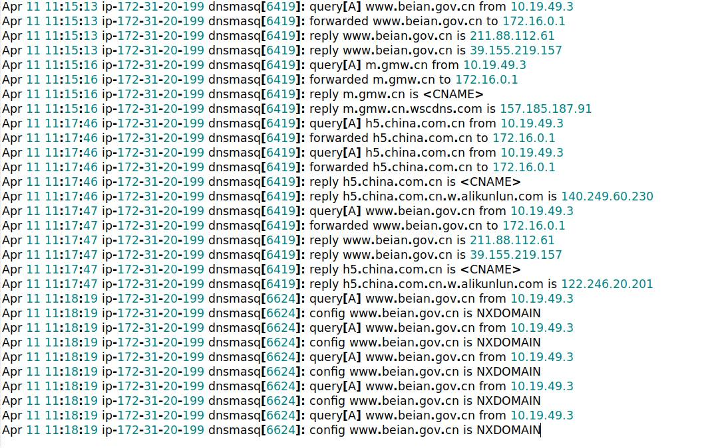
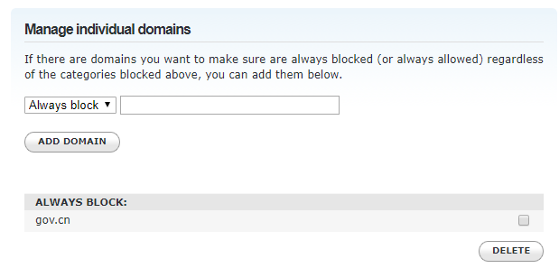

# huawei-block-list

<p align="center"></p>

Domain names on `master.txt` are captured DNS requests from Huawei P30 Pro, located in China and/or has an IP address within China's ASN. The device hasn't configured with Huawei services, including Huawei ID or any Hi services.

Please note that:
- The block list may includes test domain names, `baidu.com` and `qq.com`.
- By relying on techniques in `update.py` to verify location domain names. Some domain names such as `tencent-cloud.net` and `hwcdn.net` are not flagged. I will find a way to fix this issue later.

## Setup Blocking with Algo VPN

1. Setup [Algo VPN](https://github.com/trailofbits/algo) and enable adblocking feature on both server and client-side
2. Update `/usr/local/sbin/adblock.sh` to include [the raw version of block list](https://raw.githubusercontent.com/pe3zx/huawei-block-list/master/master.txt). The block list should be appended to `BLOCKLIST_URLS` variable.

```sh
awk '{gsub(/"$/,"https://raw.githubusercontent.com/pe3zx/huawei-block-list/master/master.txt \"")}' /usr/local/sbin/adblock.sh
```

3. Execute `/usr/local/sbin/adblock.sh` to apply new block list to dnsmasq. The script will be automatically executed by cron to pull and apply any updates.

```sh
sh /usr/local/sbin/adblock.sh
```

## Setup Blocking with OpenDNS

If you don't have your own server or don't want to mess with configuration stuff, you can get [a free OpenDNS account](https://www.opendns.com/home-internet-security/) which you can create up to 25 domains to block. However, OpenDNS doesn't support leading dot domain like `.cn`. I recommend to add each domain which has only ccTLD, and add something like `gov.cn` or `com.cn` to make you life easier.

<p align="center"></p>